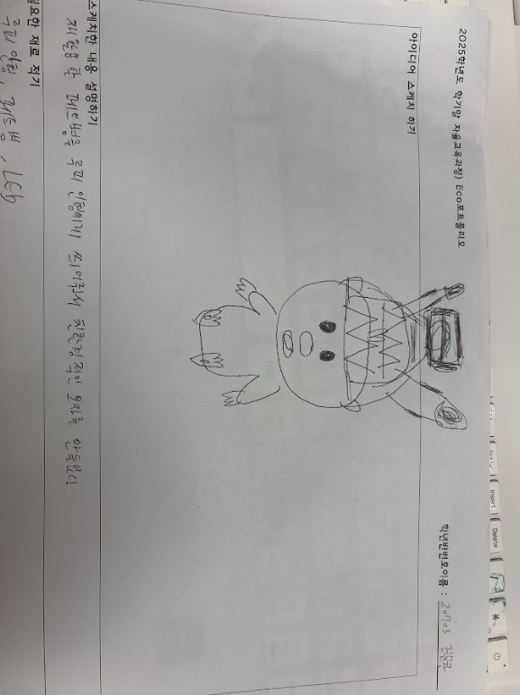

# 🌱 에코아트 프로젝트: [앞이 잘 보이게 할 수 있는 친환경 제품 PET 모자]

## 📖 프로젝트 개요
- **제작자**: [20703 김문찬]
- **제작일**: [7월 16일]
- **소개**
버려지는 플라스틱 쓰레기를 재활용 하기 위함이고 이 버려지는 플라스틱을 잘 보이지 않는 밤길에 불이 나오도록 더 잘 보이는 모자를 만드는 것이 목표였고,
제가 의도 한 것은, 자원을 아끼면서 즉 예술 작품이 탄생하고 이 예술작품이 다른사람에게 유용하게 이용 될 수 있다는 것을 표현하고 싶었습니다.

## 📦 사용 재료
- 아두이노, 온도센서, LED, 브레드보드
- 페트병, 그림 도안,루피 인형

## 🔧 제작 과정

### 1단계: 아이디어 스케치

- 아이디어 설명
- 예상 완성도

### 2단계: 완성품

## 💭 제작 후기
### 잘된 점
- 재료가 부족하다고 느꼈는데 생각보다 개인적으로는 멋진 작품이 탄생해서 뿌듯했고, 이렇게 플라스틱을 재활용해서
  멋진 예술 작품을 만들 수 있구나 라는 것을 깨달았다.

### 아쉬운 점
- 상상속에서 그린 최종본이랑 다른 완성품이 나와서 아쉬웠다 조립 하고 이런 것이 서툴어서 다른 애들보다 조금 느리게
  하는 느낌이 들었고 이번 계기로 다음에는 이전 보다 더 잘 할 것 이라고 다짐했다.

### 개선할 점
- 페트병이 너무 작아서 만드는게 어려웠다 다음에는 페트병을 조금 더 큰 것을 가져와서 더 수월하게 만들어야겠다고 생각했습니다.

### 내가 이미 알고 있었던 것
- 재활용 하는 것은 매우 중요하고 재활용품을 그냥 버려 버리는것이 아닌 우리가 생활할때 사용 할 물품이라고 여겨야한다.

### 새롭게 배운게 된 것
- 단순히 재활용품이 어쩔 때는 그냥 쓰레기처럼 여겨지기도 했지만 이렇게 만들고보니 예술작품을 탄생 시킬 수 있구나를 꺠달았다.
  앞으로 나도 재활용품을 가지고 새로운 것을 만들어서 일상생활에서 편리한 삶을 살아보고 친환경적인 생황을 하기로 결심했다.

### 더 알고 싶은 것
- 이런 활동이 아직 익숙치 않아서 아두이노를 가지고 어떤 예술 작품이 탄생 할지 아두이노를 활용한 멋진 작품을
  눈으로 더 보고싶고 아누이노에 대해서 더 세부적이게 알고싶다.

## 🌍 환경적 의미
- 이 작품이 환경에 미치는 긍정적 영향: 플라스틱을 재활용함으로써 매립지와 바다에 버려지는 플라스틱 쓰레기를 줄이는데 큰 역할을 한다.
- 사용한 재활용 재료가 환경에 미치는 의미: 페트병은 열가소성 플라스틱으로 재활용이 비교적 잘 되는 편입니다. 이 것이 적절히 수거,분리된다면 순환자원으로 활용 가능하다.
- 앞으로의 환경 보호 다짐 등: 일회용품 대신 다회용품을 사용하고, 재활용을 철저히 하겠습니다.

## 📚 참고 자료
- [환경 관련 웹사이트](https://www.worldwildlife.org/)
- [참고한 에코아트 작품](https://www.greenpeace.org/korea)

## 🏷️ 태그
#에코아트 #재활용 #환경보호 #DIY #창의활동
#지구를지켜요 #친환경 #지속가능한미래 #에코라이프

> 이 프로젝트는 환경 보호와 창의적 사고를 위한 교육 목적으로 제작되었습니다.
